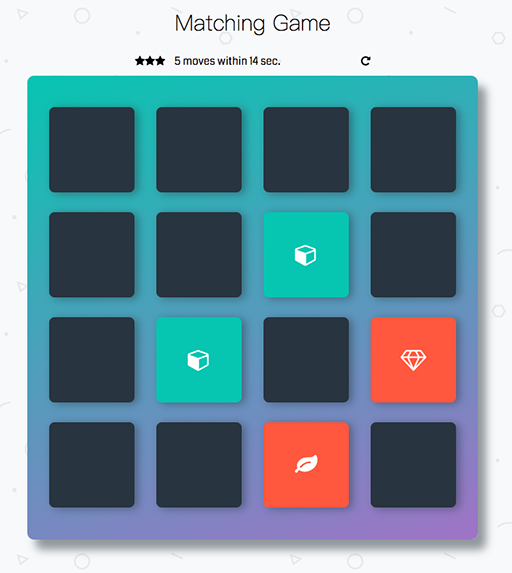

# Memory Game Project

This is a browser-based card matching game. The starter code from Udacity has some HTML and CSS styling to diaplay a static version of the Memory Game project. The updated code will modify the HTML and CSS files, but primarily the JavaScript file to covert this project to an interactive one. 

### How the Game Works
The game board consists of sixteen "cards" arranged in a grid. The deck is made up of eight different pairs of cards, each with different symbols on one side. The cards are arranged randomly on the grid with the symbol face down. The gameplay rules are very simple: flip over two hidden cards at a time to locate the ones that match!

Each turn:

- The player flips one card over to reveal its underlying symbol.
- The player then turns over a second card, trying to find the corresponding card with the same symbol.
- If the cards match, both cards stay flipped over.
- If the cards do not match, both cards are flipped face down.
- The game ends once all cards have been correctly matched.

### How to run the game
1. Clone the game in local or unzip file to your local machine.
2. Go to "fend-project-memory-game" folder.
3. Open "index.html" on your brower 
Enjoy your game!! :)

